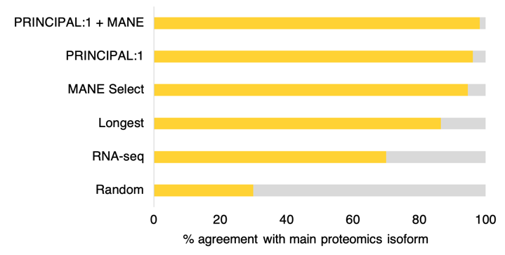
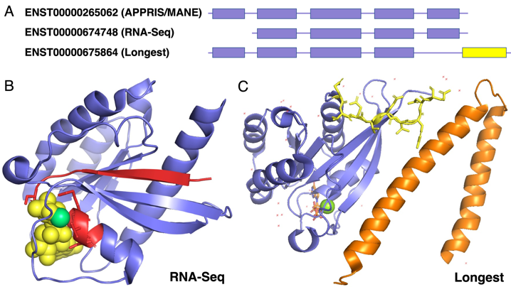
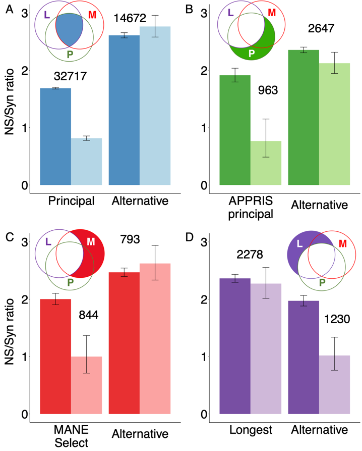

---
# Basics
title: 'APPRIS Principal and MANE Select Define Reference Splice Variants'
author:
  - name: '**Fernando Pozo**'
    main: true
    twitter: fpozoca
    email: fpozoc@cnio.es
    orcid: '0000-0001-7688-6045'
  - name: Laura Martínez Gómez
    main: false
    email: lmartinezg@cnio.es
    orcid: '0000-0001-9843-1332'
  - name: Jose Manuel Rodríguez
    main: false
    email: josemanuel.rodriguezcarrasco@cnic.es
    orcid: '0000-0002-2481-0599'
  - name: Jesús Vázquez
    main: false
    email: jesus.vazquez@cnic.es
    orcid: '0000-0003-1461-5092'
  - name: Michael L. Tress
    main: false
    twitter: MichaelTress
    email: mtress@cnio.es
    orcid: '0000-0001-9046-6370'
affiliation:
  address: Bioinformatics Unit, Spanish National Cancer Research Center (CNIO)
poster_width: 48in
poster_height: 36in
font_family: 'Open Sans'
titletext_fontfamily: 'Open Sans'

# Main Colour Scheme
primary_colour: '#76b5c5' 
secondary_colour: '#332A38' 
accent_colour: '#3540b0e04D6D' 

# Further Customization
# Title Box
titlebox_bordercol:	"#76b5c5"	# Colour of the title box border.
title_textsize: "110px" # Poster title fontsize.
titlebox_borderwidth:	"0in"	# Width of the title box border.
title_textcol:	"#ffffff"	# Colour of title text
author_textcol:	"#ffffff"	# Colour of author text.
author_textsize:	"60px"	# Author list font size.
affiliation_textsize:	"30px"	# Affiliation font size.
affiliation_textcol:	"#ffffff"	# Affiliation font size.
logoleft_name:	"../../img/gencode_cnio.png"	# Location of the image to use.
logoright_name:	"img/qr.png"

# Poster Body
body_bgcol: "#ffffff"	 # Colour of the poster main background.
body_textsize: "51px" # Size of the main poster body text.
body_textcol:	"#000000"	# Colour of main text in the body of poster.
column_numbers:	3	# Number of columns that the poster body has.
column_margins:	"0.5in"	# Margin spacing for columns.
columnline_col:	"#d7d8db"	# Colour of the column line dividers.
columnline_width:	"2mm"	# Width of line between each column.
columnline_style:	'solid'	# Style of the column line seperator.
sectitle_textcol:	"#ffffff"	# Colour of the poster section titles.
sectitle_textsize:	"100px"	# Text size of the section titles (H1).
sectitle2_textsize:	"38pt"	# Text size of the section titles (H2).
sectitle_bgcol:	"#76b5c5"	# Colour of the section title box.
sectitle_bordercol:	"#ffffff"	# Colour of the border around the section title box.
sectitle_borderwidth:	"2mm"	# Thicknes of the section title box border.
sectitle_boxshape:	"4mm 1mm"	# Changes the shape of the section title box.
sectitle2_textcol:	"#8d99ae"	# Color of 2nd level header text.
reference_textsize: "10px"
link_col:	"#8d99ae"	# Colour of other links within the poster.

output: 
  posterdown::posterdown_html:
    self_contained: true
    fig_caption: yes
    number_sections: false

---
<style>
p.caption {
  font-size: 0.80em;
}
</style>

```{r setup, include=FALSE}
knitr::opts_chunk$set(echo = FALSE)
```

# Introduction
## Motivation

**Selecting the splice variant that best represents a coding gene** is a crucial first step in many experimental analyses, and vital for mapping clinically relevant variants. 

## Objectives

To determine which method is best (**APPRIS principal, MANE Select transcript, longest isoform or transcirpt expression**) for selecting biological important reference splice variants for large-scale analyses.

## Availability of Data

Now **[appris.bioinfo.cnio.es](https://appris.bioinfo.cnio.es/#/)** contains the list of splice variants where APPRIS and MANE agree

# Methods

**GENCODE v37 gene set**: Provided APPRIS principal isoforms, MANE (Matched Annotation from NCBI) Select transcripts, and longest isoforms/CDS

**RNA-seq from Human Protein Atlas**: data from 36 dierent human tissues was leveraged with QSplice (our in-house method to quantify splice-junctions) and RSEM transcript counts.

**Large-scale proteomics**: Five datasets covering 52 distinct tissue types were analysed with Comet and Percolator. We used peptide-spectrum match counts to determine main proteomics isoforms.

**Germline variants**: for all sets of exons we calculated the NS/Syn ratios for both rare and common allele frequencies using variants from the  2504 individuals in the 1000 Genomes Project phase 3.

<div>
</div>

# Results
## Main protein isoforms and reference predictions agreement
```{r figure1-pkgdown, out.width="90%", fig.cap='The percentage of genes in which predicted reference isoforms coincided with proteomics main isoforms.'}

```

## Reference selected by different methods for RAB7A

````{r figure2-pkgdown, out.width="100%", fig.cap='APPRIS and MANE chose the same transcript. The RNA-Seq transcript (ENST00000674748) is missing the first coding exon; the longest isoform has a different 3’ CDS (in yellow). APPRIS and MANE both select the highly conserved 5\' exon transcript as the most important splice variant.'}

```

<div style="text-align: center; font-size: 65%; font-style: italic;", markdown = "1">
<br>
<br>
<br>
This work has been funded by the US National Institutes of Health grant 2 U41 HG007234.
<br>
</div>

## MANE and APPRIS main exons are under purifying selection

```{r figure3-pkgdown, out.width="90%", fig.cap='Ns/Syn ratios for rare (dark bars) and common (light bars) variants (95% CI) for reference and alternative exons. The number of exons in each set is indicated above. Exons “L” are those that produce the longest isoform, “M” are present in MANE Select transcripts, and “P” represent APPRIS principal isoforms.'}

```

# Conclusions

The main cellular isoform is best described by APPRIS principal isoforms and MANE Select transcripts, and these methods are particularly powerful when they agree.

Researchers should use these 2 sets of reference transcripts, rather than the longest isoform, in all biomedical research.

<!-- # Acknowledgements

. -->

<!-- to render the poster
https://github.com/brentthorne/posterdown/wiki/Installation-&-Usage-Guide#rendering-posters
pagedown::chrome_print("poster.Rmd")
. -->

